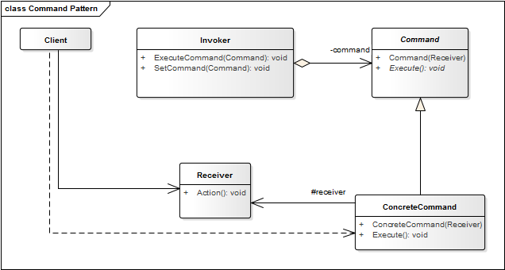

# Command Pattern

El patron *Command* encapsula comandos( llamados a metodos) en objetos, permitiendonos realizar peticiones sin conocer exactamente la peticion que se realiza o el objeto al cual se le hace la peticion. Este patron nos provee las opciones para hacer listas de comandos, hacer/deshacer acciones y otras manipulaciones.

Dicho de otra manera **Command** nos permite ejecutar operaciones sin conocer los detalles de la implementacion de la misma. Las operaciones son conocidas como comandos y cada operacion es implementada como una clase independiente que realiza una accion muy concreta, para lo cual, puede o no recibir parametros para realizar su tarea. Una de las ventajas que ofrece este patron es la de poder crear cuantos comandos requerimos y encapsularlos bajo una interface de ejecucion.

Este patron desacopla al *objeto que invoca* la operacion del *objeto que sabe como* llevar a cabo la misma. Un objeto llamado *Invoker* transfiere el *comando* a otro objeto llamado *Receiver* el cual ejecuta el codigo correcto para el *comando* recibido.

**Ventajas:**
* Bajo acoplamiento entre el objeto que realiza el pedido y el que lo lleva a cabo 

**Proposito:** Encapsular una peticion en forma de objeto, permitiendo de ese modo que parametrizar clientes con diferentes peticiones, "colas" o registros de solicitudes, y apoyar las operaciones de deshacer.

**Aplicacion:** Usamos el patron Command...
* Cuando queremos realizar peticiones en diferentes tiempos. Se puede hacer a traves de la especificacion de una "cola".
* Para implementar la funcion de deshacer (*undo*), ya que se puede almacenar el estado de la ejecucion del comando para revertir sus efectos.
* Cuando necesitemos mantener un registro (*log*) de los cambios y acciones.

**Usos tipicos:**
* Mantener un historial de peticiones. (*requests*)
* Implementar la funcionalidad de *callbacks*.
* Implementar la funcionalidad de *undo*.

### Estructura

