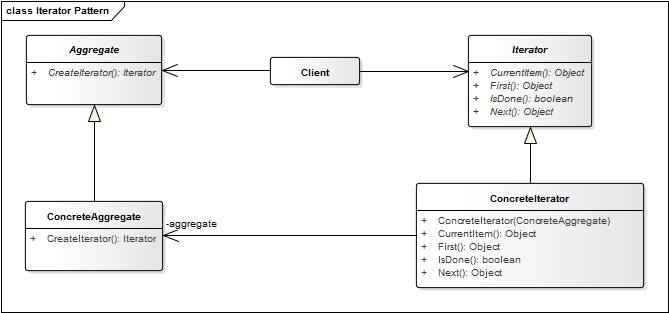

# Iterator Pattern

**Proposito:** Define una interfaz que declara los metodos necesarios para acceder secuencialmente a un grupo de objetos de una coleccion.

Algunos de los metodos que podemos definir en la interfaz Iterador son:

Primero(), Siguiente(), HayMas() y ElementoActual().

Permite variaciones en el recorrido de un agregado; para cambiar el algoritmo de recorrido basta cambiar la instancia de Iterator concreta.

Nuevos recorridos mediante nuevas subclases de Iterator.

Los iteradores simplifican la interfaz del contenedor.

Puede hacerse mas de un recorrido a la vez sobre un mismo agregado.

**Aplicacion:** Usamos el patron Iterator cuando ...
* Se desea acceder a los elementos de un contenedor de objetos (por ejemplo, una lista) sin exponer su representacion interna.

**Ventaja:**

* Accede al contenido de la instalacion, sin exponer la implementacion interna.

### Estructura

