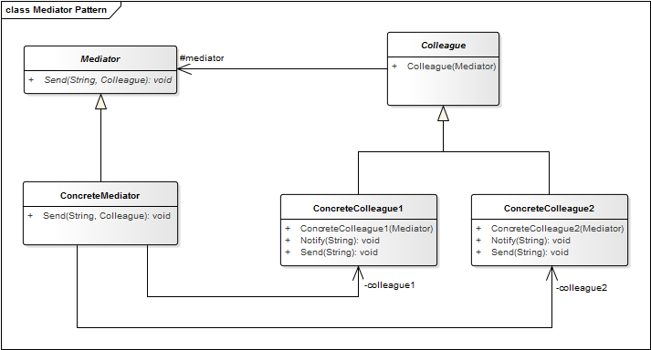

# Mediator Pattern

**Proposito:** Define un objeto que encapsula como un conjunto de objetos interactuan, pudiendo alterar el comportamiento del programa en ejecucion

La comunicacion entre objetos es encapsulada con un objeto mediador. Los objetos no se comunican de forma directa entre ellos, en lugar de ello se comunican mediante el mediador. Esto reduce las dependencias entre los objetos en comunicacion, reduciendo entonces la Dependencia de codigo.

El patron de diseño Mediator se encarga de gestionar la forma en que un conjunto de clases se comunican entre si, Mediator es especialmente util cuando tenemos una gran cantidad de clases que se comunican de forma directa, ya que mediante la implementacion de este patron podemos crear una capa de comunicacion bidireccional, en la cual las clases se pueden comunicar con el resto de ellas por medio de un objeto en comun que funge como un mediador o intermediario.

**Aplicacion:** Usamos el patron Mediator cuando ...
* Se desea reducir la dependencia entre clases evitando que los objetos se relacionen entre ellos de forma explocita, y permitiendo variar cualquier interaccion independientemente.

**Ventaja:**

* Limita la subclase. Un mediador localiza el comportamiento que de otro modo se distribuiria entre varios objetos. Cambiar este comportamiento requiere solo subclasemediator, las clases Colleague se pueden reutilizar tal como esta.

**Desventaja:**

* Centraliza el control. El patron de mediador intercambia la complejidad de la interaccion por la complejidad en el mediador. Dado que un mediador encapsula los protocolos, puede llegar a ser mas complejo que cualquier colega individual. Esto puede hacer que el propio mediador sea un monolito que es dificil de mantener

### Estructura

