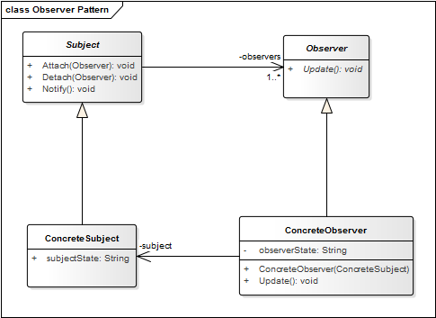

# Observer Pattern

**Proposito:** Definir una dependencia de uno a muchos entre los objetos de manera que cuando un objeto cambia de estado, todos los que dependen de el son notificados y se actualizan automaticamente.

El patron de diseño  __Observer__  permite observar los cambios producidos por un objeto, de esta forma, cada cambio que afecte el estado del objeto observado lanzara una notificacion a los observadores; a esto se le conoce como Publicador-Suscriptor. 

Los *Observers* se registran con el *Subject*  a medida que se crean. Siempre que el Subject cambie, difundira a todos los Observers registrados que ha cambiado, y cada Observer consulta al Subject que supervisa para obtener el cambio de estado que se haya generado.

Observer es uno de los principales patrones de diseño utilizados en interfaces graficas de usuario (GUI), ya que permite desacoplar al componente grafico de la accion a realizar.

En Java tenemos acceso a la clase Observer mediante [java.util.Observer](http://docs.oracle.com/javase/8/docs/api/java/util/Observer.html)

**Aplicación:** Usamos el patron Observer cuando...
* Un cambio en un objeto requiere cambiar los demas, pero no sabemos cuantos objetos hay que cambiar.
* Configurar de manera dinamica un componente de la Vista, enves de estaticamente durante el tiempo de compilacion.
* Un objeto debe ser capaz de notificar a otros objetos sin que estos objetos estan fuertemente acoplados.

## Estructura
