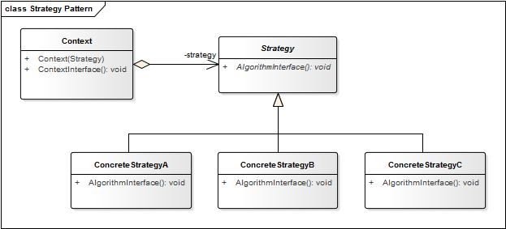

# Strategy Pattern

**Propósito:** Definir una familia de algoritmos, encapsular cada uno, y que sean intercambiables. Strategy permite al algoritmo variar independientemente de los clientes que lo utilizan.

El patrón de diseño strategy permite establecer en tiempo de ejecución el rol de comportamiento de una clase. 

Stretagy se basa en el polimorfismo para implementar una serie de comportamientos que podrán ser intercambiados durante la ejecución del programa, logrando con esto que un objeto se pueda comportar de forma distinta según la estrategia establecida.

**Aplicación:** Usamos el patrón Strategy cuando queremos...
* Definir una familia de comportamientos.
* Definir variantes de un mismo algoritmo.
* Poder cambiar el comportamiento en tiempo de ejecución, es decir, dinámicamente.
* Reducir largas listas de condicionales.
* Evitar código duplicado.
* Ocultar código complicado, o que no queremos revelar, del usuario.

## Estructura
