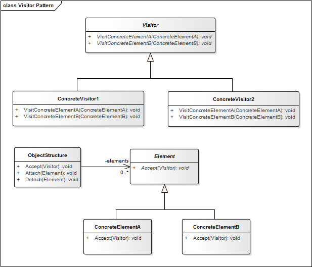

## Visitor Pattern

**Propósito:** Separar el algoritmo de la estructura de un objeto.

El patrón de diseño Visitor se utiliza para separar la lógica u operaciones que se pueden realizar sobre una estructura compleja. En ocasiones nos podemos encontrar con estructuras de datos que requieren realizar operaciones sobre ella, pero estas operaciones pueden ser muy variadas e incluso se pueden desarrollar nuevas a medida que la aplicación crece.

A medida que estas operaciones crecen, el número de operaciones que deberá tener la estructura también crecerá haciendo que administrar la estructura sea muy complejo. Por esta razón el patrón de diseño Visitor propone la separación de estas operaciones en clases independientes llamadas Visitantes, las cuales son creadas implementando una interface común y no requiere modificar la estructura inicial para agregar la operación.

La idea básica es que se tiene un conjunto de clases elemento que conforman la *estructura* de un objeto. Cada una de estas clases elemento tiene un método aceptar (accept()) que recibe al objeto visitante (visitor) como argumento. El visitante es una interfaz que tiene un método visit diferente para cada clase elemento; por tanto habrá implementaciones de la interfaz visitor de la forma: visitorClase1, visitorClase2... visitorClaseN. El método accept de una clase elemento llama al método visit de su clase.

Si hay demasiadas implementaciones de la interface visitor, se hace dificil extender.

**Aplicación:** Usamos el patrón Visitor cuando ...
* Se desea mover la lógica operacional desde los objetos a otra clase.
* Se desea definir una operación sobre objetos de una jerarquía de clases sin modificar las clases sobre las que opera.
* Se desea representar una operación que se realiza sobre los elementos que conforman la estructura de un objeto
* Teniendo un buen número de instancias de un pequeño número de clases, se desea realizar alguna operación que involucra a todas o a la mayoría de ellas.

## Estructura
