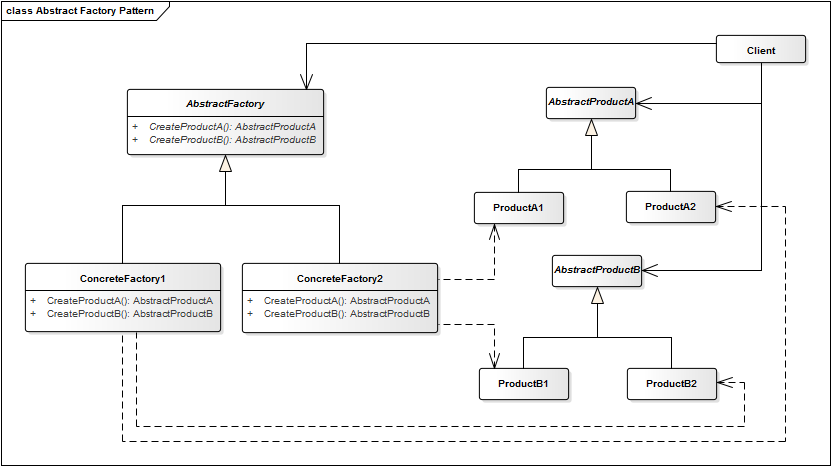

# Abtract Factory Pattern

**Propósito:** Proveer una interfaz para la creación de familias u objetos dependientes relacionados, sin especificar sus clases concretas.

Es una jerarquía que encapsula muchas *familias* posibles y la creación de un conjunto de *productos*. El objeto "fábrica" tiene la responsabilidad de proporcionar servicios de creación para toda una familia de productos. Los "clientes" nunca crean directamente los objetos de la familia, piden la fábrica que los cree por ellos.

Esta se usa cuando hay varios productos con estructura similar pero diferente comportamiento.

**Aplicación:** Usamos el patrón Abstract Factory...
* Cuando tenemos una o múltiples familias de productos.
* Cuando tenemos muchos objetos que pueden ser cambiados o agregados durante el tiempo de ejecución.
* Cuando queremos obtener un objeto compuesto de otros objetos, los cuales desconocemos a que clase pertenecen.
* Para encapsular la creación de muchos objetos.

## Estructura
