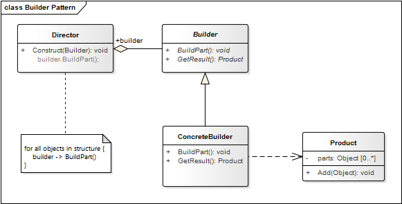

# Builder Pattern

**Propósito:** Separar la construcción de un objeto complejo de su representación para que el mismo proceso de construcción puede crear diferentes representaciones.

Nos permite crear un objeto que está compuesto por muchos otros objetos. Sólo el "*Builder*" conoce a detalle las clases concretas de los objetos que serán creados, nadie más.

En este patrón intervienen un "*Director*" y un "*Builder*". El "*Director*" invoca los servicios del "*Builder*" el cual va creando las partes de un objeto complejo y al mismo tiempo guardo un estado intermedio de la construcción del objeto. Cuando el producto se ha construido por completo el *cliente* recupera el resultado.

A diferencia de otros patrones creacionales que construyen productos de una sola vez, el patrón "*Builder*" construye paso a paso los productos bajo el control del "*Director*".

**Aplicación:** Usamos el patrón Builder cuando queremos...
* Construir un objeto compuesto de otros objetos.
* Que la creación de las partes de un objeto sea independiente del objeto principal.
* Ocultar la creación de las partes de un objeto del *cliente*, de esta manera no existe dependencia entre el *cliente* y las partes.

**Ventaja:**
* Permite variar la representación interna de un objeto 
* Aísla el código de representación del cliente
* Da más control sobre el proceso de construcción

**Desventaja:**
* Se requiere más conocimiento del dominio para construir los objetos.

## Estructura
