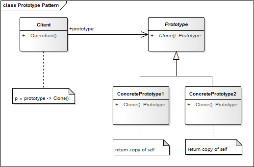

# Prototype Pattern

**Propósito:** Especificar varios tipos de objetos que pueden ser creados en un prototipo para crear nuevos objetos copiando ese prototipo. Reduce la necesidad de crear subclases.

El patrón Prototype basa su funcionalidad en la clonación de objetos, estos nuevos objetos son creados mediante un pool de prototipos elaborados previamente y almacenados. 

Este patrón es especialmente útil cuando necesitamos crear objetos basados en otros ya existentes o cuando se necesita la creación de estructuras de objetos muy grandes, este patrón nos ayuda también a ocultar la estrategia utilizada para clonar un objeto.

**Aplicación:** Usamos el patrón Prototype...
* Queremos crear nuevos objetos mediante la *clonación* o *copia* de otros.
* Cuando tenemos muchas clases potenciales que queremos usar sólo si son requeridas durante el tiempo de ejecución.

**Ventajas:**
* Acceso controlado a una única instancia 
* Permite añadir y eliminar clases en tiempo de ejecución 
* Reduce la herencia
* Reduce el costo de crear nuevos objetos

**Desventajas:**
* Cada subclase de Prototipo debe implementar la operación clonar

## Estructura
