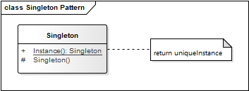

# Singleton Pattern

**Propósito:** Asegurar que una clase tenga una única instancia y proporcionar un punto de acceso global a la misma. El *cliente* llama a la función de acceso cuando se requiere una referencia a la instancia única.

El patrón de diseño Singleton (Unico) recibe su nombre debido a que sólo se puede tener una única instancia para toda la aplicación de una determinada clase, esto se logra restringiendo la libre creación de instancias de esta clase mediante el operador new e imponiendo un constructor privado y un método estático para poder obtener la instancia.

La intención de este patrón es garantizar que solamente pueda existir una única instancia de una determinada clase y que exista una referencia global en toda la aplicación.

**Aplicación:** Usamos el patrón Singleton...
* La aplicación necesita una, y sólo una, instancia de una clase, además está instancia requiere ser accesible desde cualquier punto de la aplicación.
* Tipicamente para:
  * Manejar conexiones con la base de datos.
  * La clase para hacer Login.

**Ventajas:**
* Permite variar la representación interna de un objeto 
* Aísla el código de representación del cliente
* Da más control sobre el proceso de construcción

**Desventaja:**
* Se requiere más conocimiento del dominio para construir los objetos

## Estructura

  