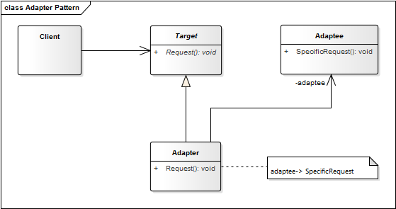

# Adapter Pattern

Como cualquier adaptador en el mundo real este patrón se utiliza para ser una interfaz, *un puente*, entre dos objetos. En el mundo real existen adaptadores para fuentes de alimentación, tarjetas de memoria de una cámara, entre otros. En el desarrollo de software, es lo mismo.

**Propósito:** Convertir la interfaz (**adaptee**) de una clase en otra interfaz (**target**) que el *cliente* espera. Permitir a dos interfaces incompatibles trabajar en conjunto. Este patrón nos permite ver a nuevos y distintos elementos como si fueran igual a la interfaz conocida por nuestra aplicación.

**Aplicación:** Usamos el patrón 
* Cuando el *cliente* espera usar la interfaz de destino (**target**).
* Deseamos usar una clase existente pero la interfaz que ofrece no concuerda con la que necesitamos.

**Componentes:**
* __Adaptada:__ Se trata de la clase adaptada (o a adaptar). Se trata de una clase existente la cual pretendemos adaptar para que funcione bajo una nueva interfaz. Puede haber varios Adaptados.

* __Objetivo:__ Nueva interfaz utilizada por Client a la que debemos adaptar a adaptados.

* __Adaptor:__ Clase que implementara la interfaz Objetiva y se encargara de que la antigua funcionalidad obedezca a la misma.

* __Cliente:__ Utiliza la funcionalidad de Adaptada de acuerdo a la interfaz Objetivo implementada por Adaptor.

* __Ventajas:__ hace que dos interfaces incompatibles, sean compatibles. Sirve para encapsular clases que no controlamos, y que pueden cambiar.

* __Desventajas:__ Añade complejidad adicional al diseño.

## Estructura

