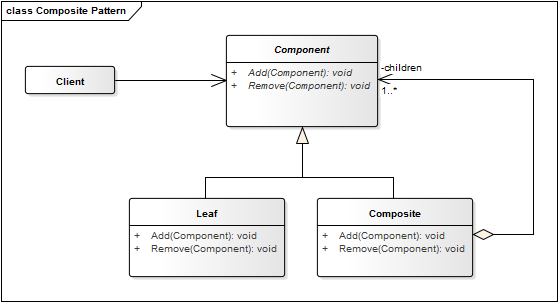

# Composite Pattern

**Propósito:** Componer objetos en estructuras de árbol que representan jerarquías de un *todo* y sus *partes.* El Composite provee a los *clientes* un mismo trato para todos los objetos que forman la jerarquía.

El patrón de diseño Composite nos sirve para construir estructuras complejas partiendo de otras mucho más simples; dicho de otra manera, podemos crear estructuras compuestas que están conformadas por otras estructuras más pequeñas.

Pensemos en nuestro sistema de archivos, este contiene *directorios* con *archivos* y a su vez estos *archivos* pueden ser otros *directorios* que contenga más *archivos*, y así sucesivamente. Lo anterior puede ser representado facilmente con el patrón Composite.

**Aplicación:** Usamos el patrón Composite...
* Cuando queremos representar jerarquías de objetos
compuestas por un todo y sus partes.
* Se quiere que los *clientes* ignoren la diferencia
entre la composición de objetos y su uso
individual.

## Estructura
