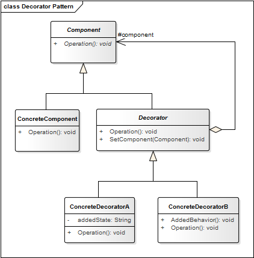

# Decorator Patter

Extender la funcionalidad de los objetos se puede hacer de forma estática en nuestro código (tiempo de **compilación**) mediante el uso de la herencia, sin embargo, podría ser necesario extender la funcionalidad de un objeto de manera dinámica.

* Se pueden revocar responsabilidades antes asignadas a nuestros objetos.
* La extensión mediante herencia viola los principios SOLID.
* Necesitamos extender la funcionalidad de una clase pero la herencia no es una solución viable.
* Necesitamos extender la funcionalidad de un objeto en tiempo de ejecución e incluso eliminarla si fuera necesario.

**Propósito:** Adjuntar responsabilidades adicionales a un objeto de forma **dinámica**. Los *decoradores* proporcionan una alternativa flexible para ampliar la funcionalidad.

**Aplicación:** Usamos el patrón
* Cuando necesitamos añadir o eliminar dinámicamente las responsabilidades a un objeto, sin afectar a otros objetos.
* Cuando queremos tener las ventajas de la *Herencia* pero necesitemos añadir funcionalidad durante el tiempo de ejecución. Es más flexible que la *Herencia*,
* Simplificar el código agregando funcionalidades usando muchas clases diferentes.
* Evitar sobreescribir código viejo agregando, envés, código nuevo.

**Ventajas:**
* Más flexibilidad que la herencia estática.
* Evita que las clases de arriba de la jerarquía estén repletas de funcionalidades. 
* En vez de definir una clase compleja que trata de dar cabida a todas ellas, la funcionalidad se logra añadiendo decoradores a una clase simple.
 
**Desventajas:** 
* Un decorador y sus componentes no son idénticos, desde el punto de vista de la identidad de objetos, desde el punto de vista del programador o del cliente si que se podrían considerar iguales.
* Muchos objetos pequeños. 
* El sistema puede ser más difícil de aprender y de depurar.

## Estructura
