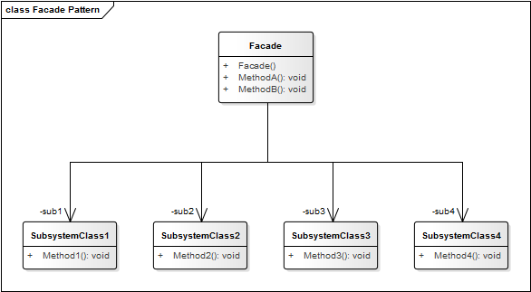

 Facade Pattern

**Propósito:** Proporcionar una interfaz unificada para un conjunto de interfaces de un subsistema. *Facade* define una interfaz de alto nivel que hace que el subsistema sea más fácil de usar.

El patrón Facade (fachada) tiene la característica de ocultar la complejidad de interactuar con un conjunto de subsistemas proporcionando una interface de alto nivel, la cual se encarga de realizar la comunicación con todos los subsistemas necesarios. La fachada es una buena estrategia cuando requerimos interactuar con varios subsistemas para realizar una operación concreta ya que se necesita tener el conocimiento técnico y funcional para saber qué operaciones de cada subsistema tenemos que ejecutar y en qué orden, lo que puede resultar muy complicado cuando los sistemas empiezan a crecer demasiado.

**Detalles:**
* Este patrón protege los clientes de los componentes del subsistema, propiciando el menor uso de componentes para que el subsistema pueda ser utilizado.
* Además, promueve un bajo acoplamiento entre subsistemas y clientes.
* Este patrón no evita que los clientes usen las clases internas del subsistema, si es que es necesario.
* Es importante mencionar que el objeto *Facade* debe ser extremadamente simple. **No** debe convertirse en un **objeto "dios".**

**Aplicación:** Usamos el patrón
* Cuando queremos encapsular un subsistema complejo con una interface más simple.
* Para crear una interface simplificada que ejecuta muchas acciones "detras del escenario".
* Existen muchas dependencias entre clientes y la implementación de clases de una abstracción. Se introduce el facade para desacoplar el subsistema de los clientes y otros subsistemas.
* Necesitamos *desacoplar* subsistemas entre sí, haciendo que se comuniquen únicamente mediante *Facades*.
* Para definir un punto de entrada a cada nivel del subsistema.

**Ventajas:**
* Ayuda a dividir un sistema en capas.
* Reduce dependencias de compilación.
* Se evita la herencia que por los tipos de relaciones puede ser complicada de usar.

**Desventajas:**
* Permite vulnerar seguridad, al dejar clases abiertas.
* Muchas clases pequeñas
* Hay problemas cuando el código depende de clases especícas
* Mucha complejidad para instanciar un Componente

## Estructura

