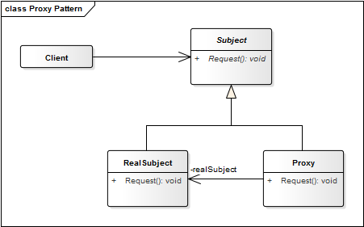

# Proxy Pattern

Un **Proxy** o sustituto:
1. Crea una instancia del objeto real la primera vez que el cliente realiza una solicitud del proxy.
2. Recuerda la identidad de este objeto real.
3. Finalmente, envía la solicitud del servicio al objeto real.

**Propósito:**
* Proveer un sustituto o *"placeholder"* de otro objeto para controlar el acceso a este.
* Usar un nivel extra de indirección para permitir el acceso distribuido, controlado e inteligente.
* Agregar un *"wrapper"* para proteger el componente real de la complejidad innecesaria. Este *wrapper* permite agregar funcionalidad al objeto de interés sin cambiar el código del objeto.

Aunque a simple vista tenga similitudes al patrón Facade, ambos tiene matices diferentes. 
* Mientras que los objetos Proxy representan a un objeto, los objetos Facade representan a un subsistema de objetos.
* Un objeto cliente Proxy no puede acceder a un objeto interno directamente, mientras que Facade no lo impide.
* Un objeto Proxy provee control de acceso a un único objeto de interés. Sin embargo, un objeto Facade provee una interface de alto nivel a un subsistema de objetos.

**Aplicación:**
* Cuando haya necesidad de una referencia más versátil y sofisticada a un objeto, no un simple puntero.
* Para adicionar seguridad al acceso de un objeto. El Proxy determinará si el cliente puede acceder al objeto de interés.
* Para proporcionar una API simplificada para que el código del cliente no tenga que lidiar con la complejidad del código del objeto de interés.
* Para proporcionar una interfaz de los *web services* o recursos *REST*.

## Escenarios de uso:

Se necesita una referencia a un objeto más flexible o sofisticada que un puntero. 
Según la funcionalidad requerida podemos encontrar varias aplicaciones:

- **Apoderado remoto (Remote Proxy):** Representa un objeto local que pertenece a un espacio de direcciones diferente.
- **Apoderado virtual (Virtual Proxy):** Retrasa la creación de objetos costosos. En lugar de un objeto complejo o pesado, utiliza una representación de esqueleto. Consideremos una imagen la cual es enorme en tamaño, podemos representarla mediante un objeto proxy virtual y cuando sea solicitado cargamos el objeto real.
- **Apoderado de protección (Protection Proxy):** Controla el acceso a un objeto original. Este tipo es útil cuando se necesita manejar diferentes permisos de acceso.
- **Referencia inteligente:** Tiene la misma finalidad que un puntero pero además ejecuta acciones adicionales sobre el objeto, como por ejemplo el control de concurrencia.

## Estructura

